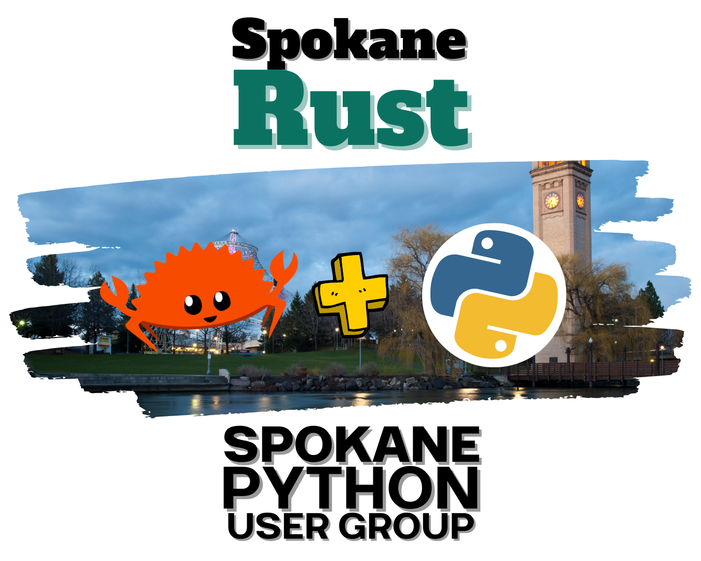

<!-- index start -->

# Spokane Rust at Python

_February 20th, 2024 @ 6PM_ | [Find Spokane Rust on Meetup! :fontawesome-brands-meetup:](https://www.meetup.com/spokane-rust/) | [Find Spokane Python on Meetup! :fontawesome-brands-meetup:](https://www.meetup.com/python-spokane/)

The organizers of Spokane Rust will be announcing the upcoming Spokane Rust User Group meetup and showcasing a special Python-related presentation! Are you interested in Rust, Python, or integrating Rust development into your Python workflow? We'll show you how to do that with PyO3! Join us on February 20th of 2024 for this special event signifying the launch of the Spokane Rust User Group! Mark your attendance here, at the [Spokane Python User Group on Meetup. :fontawesome-brands-meetup:](https://www.meetup.com/python-spokane/events/298213203/). The event will be taking place at the IntelliTect office at 6:00 PM. Visit the meetup page to get more details and an exact address!

More information on Spokane Rust can be found at the [Spokane Rust Meetup! :fontawesome-brands-meetup:](https://www.meetup.com/spokane-rust/)

<!-- index end -->