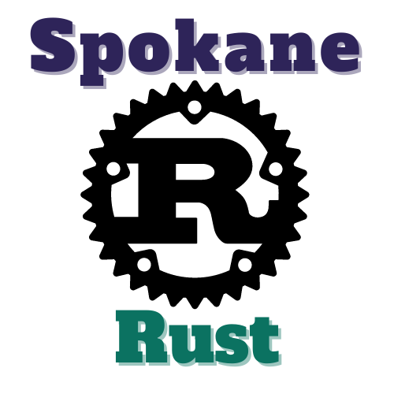

<!-- index start -->

# Spokane Rust Kick-Off

_March 21st, 2024_ | [Spokane Rust on Meetup! :fontawesome-brands-meetup:](https://www.meetup.com/spokane-rust/)

## Rustaceans and Programming Enthusiasts in the Eastern Washington area!

We are thrilled to announce our inaugural meetup kicking off Spokane Rust, our local Rustlang user group! Join us for an evening of Rust camaraderie, learning, and discussion on March 21st, 2024 at 6:00PM, taking place at the IntelliTect office 1720 W. 4th Ave. Unit B, Spokane, WA 99201. We will be discussing a reoccurring date that fits all our schedules during the meetup.

Whether you're a seasoned Rust developer or just starting your journey as a fledgling Rustacean, this is your perfect opportunity to connect with like-minded individuals, share experiences, and explore Rust's limitless potential!

Additional details will be announced as the event nears, including options for virtual attendance and the topic for the meetup!

We're looking forward to seeing you there!

<!-- index end -->