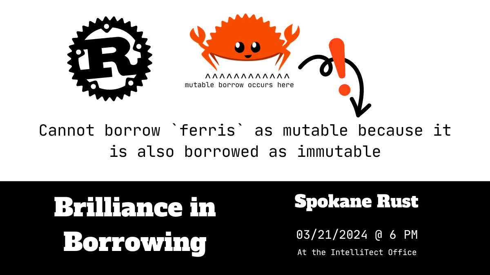

<!-- index start -->

# Brilliance in Borrowing

_March 21st, 2024 @ 6PM_ | [Find Spokane Rust on Meetup! :fontawesome-brands-meetup:](https://www.meetup.com/spokane-rust/) | [Join us on the freshair Matrix](https://matrix.to/#/!eAHYANjwVMlDvQTjQE:freshair.farm?via=freshair.farm&via=matrix.org)

## Join us for an evening of exploring Rust's borrow-checker and its complexities!

Step into the world of Rust with us as Nathan delves into the intricacies of Rust's borrow-checker. Learn of the nuances and challenges of managing memory, ownership, and lifetimes in Rust, offering insights into how the borrow-checker ensures memory safety without sacrificing performance. Regardless of your experience level with Rust, we hope you join us to deepen and evolve your understanding, and appreciation, of Rust's unique approach to memory management and most distinguishing feature!

Nathan hopes to demystify Rust's borrow checking system, empowering developers to write safer, more efficient code with confidence. Whether you're a seasoned Rust enthusiast or simply curious about its unique approach to memory management, this dive into the borrow-checker is sure to leave you inspired and eager to apply your newfound understanding in your Rust projects.

The meeting will be hosted at the IntelliTect office on March 21st at 6:00 PM. Registration not required, [but please RSVP on the meetup event here! :fontawesome-brands-meetup:](https://www.meetup.com/spokane-rust/events/299715905/)

Afterwards, join us to discuss our meeting cadence and planned updates to the Rust website and User Group as a whole. We would like to ensure everyone who would like to attend has a chance to do so, and so a piece of that discussion will be finalizing a reocurring date for meetups and exploring potential avenues for hosting additional meetups!

<!-- index end -->