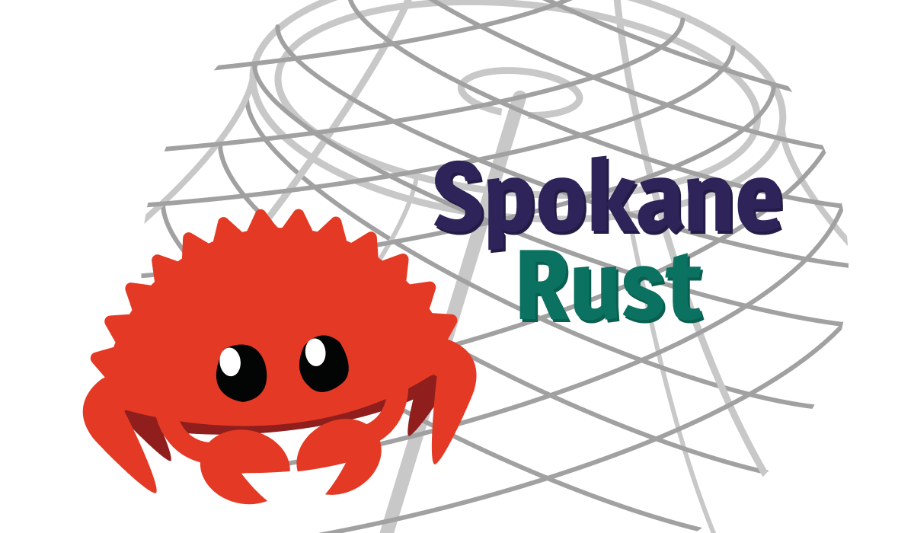

---
hide:
  - navigation
  - title
  - toc
---

# Spokane Rust User Group

## Welcome to Spokane Rust!

Spokane Rust is the premier Spokane Rust User Group. Our desire is to encourage the usage of Rust, promote healthy and productive discourse concerning the Rust language, and grant a safe space for those interested and learning the language! We're a part of the greater greater Spokane tech community and hope you'll join us!

[Find us on Meetup! :fontawesome-brands-meetup:](https://www.meetup.com/spokane-rust/) | [Join the Official Spokane Tech Discord! :fontawesome-brands-discord:](https://discord.gg/GYvdBBNTEP)

## Upcoming Events

---



## Past Events

---



---



---

!!! info
    We are in no way affiliated with the Rust project or Rust Foundation. Spokane Rust is a free-to-attend user-group created by Rust enthusiasts.
    
    All usage of the Rust trademark and Rust copyrighted material, such as the Rust logo, is covered under their usage policy, which can be read [here](https://foundation.rust-lang.org/policies/logo-policy-and-media-guide/).